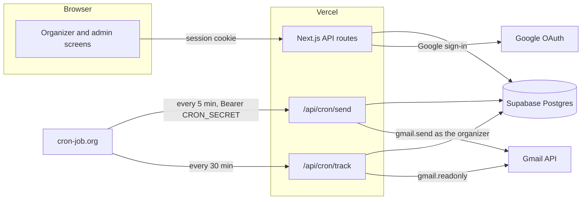
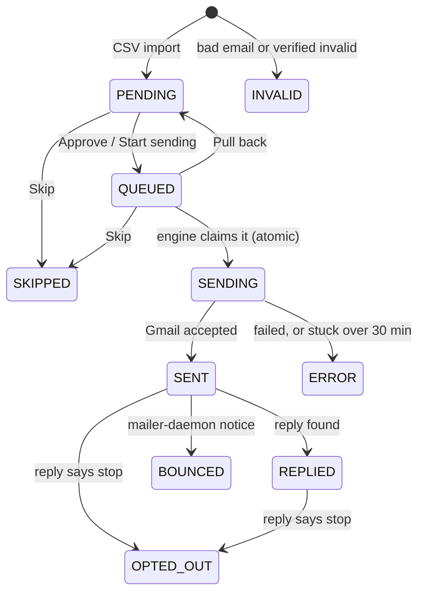
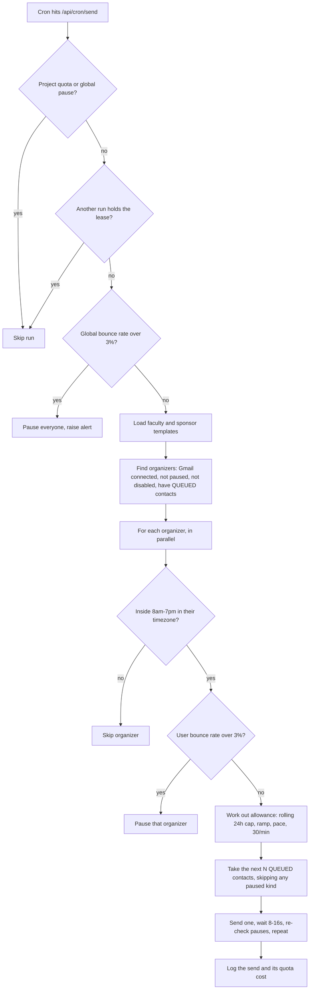
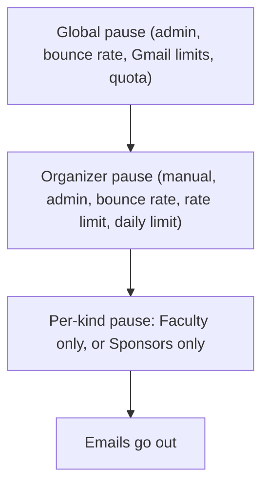
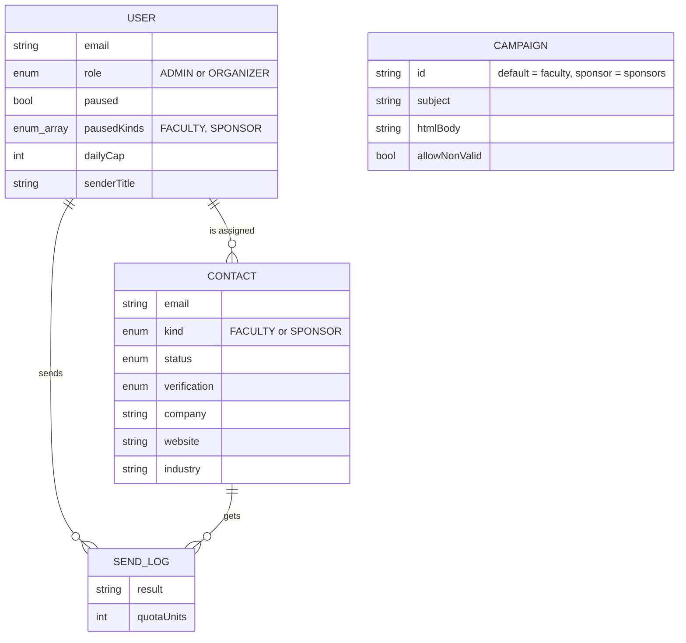
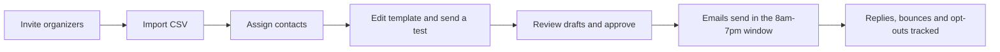

# SPARK

**S**ponsor & **P**rofessor **A**utomated **R**each **K**it

HackUTD organizers send personalized outreach emails to their assigned contacts from their **own** @acmutd.co Gmail, in one or two clicks. Two kinds of outreach run side by side, each with its own list, template, review queue and pause button:

| | Faculty | Sponsors |
|---|---|---|
| Who | Professors at universities | Companies |
| CSV email column | `email` | `best_email` |
| Greeting | `Hi Professor Smith` | `Hi Acme team` (or `Hi Jane` if a contact name exists) |
| Default verification | `unknown` (sent only if you allow it) | `valid` |
| Template row | `default` | `sponsor` |

Next.js (App Router) · TypeScript · Tailwind · Prisma + Supabase Postgres · Auth.js (Google) · Gmail API · Vercel

## Contents

- [How it works](#how-it-works)
- [Architecture](#architecture)
- [A contact's life](#a-contacts-life)
- [What happens every 5 minutes](#what-happens-every-5-minutes)
- [Pauses and safety](#pauses-and-safety)
- [Data model](#data-model)
- [Screens](#screens)
- [Local setup](#local-setup)
- [Google Cloud setup](#google-cloud-setup)
- [Deploy (Vercel)](#deploy-vercel)
- [Day-to-day](#day-to-day)
- [Templates](#templates)
- [Limits and auto-pauses](#limits-and-auto-pauses)
- [Reply, bounce and opt-out tracking](#reply-bounce-and-opt-out-tracking)
- [Error codes](#error-codes)
- [Project layout](#project-layout)
- [Tests](#tests)

## How it works

- **Admins** import a contacts CSV (Faculty or Sponsors), invite organizers, assign contacts, and edit each template.
- **Organizers** sign in, click **Connect Gmail** once, review their drafts, then **Start sending**.
- A cron hits `/api/cron/send` every 5 minutes. Each organizer inside their 8am-7pm window sends a small batch (up to 200/hour, 8-16s random gaps, so about 17 per run).
- A cron hits `/api/cron/track` every 30 minutes to detect replies, bounces and opt-outs.
- The **Faculty | Sponsors** switch at the top of every screen picks which list you are looking at. It is remembered in your browser.
- No open or click tracking. Every email gets a "reply STOP" line and the mailing address from the template.

## Architecture



Cron routes answer `202` right away and do the work in the background (`after()` from `next/server`), so cron-job.org's 30 second timeout never matters. Add `?wait=1` to run synchronously when debugging.

## A contact's life



The `QUEUED -> SENDING` step is a single conditional update, so two overlapping runs can never send the same contact twice. Contacts stuck in `SENDING` are never retried automatically, because they may have been delivered.

## What happens every 5 minutes



Each send picks the template for that contact's kind, so sponsors and faculty can be in the same batch and still get the right email.

## Pauses and safety

Pauses stack. Any one of them stops that organizer's sends.



- **Per-kind pause** is the button on the organizer dashboard. With **Sponsors** selected it reads **Pause sponsors**, and faculty keeps sending. Switch to **Faculty** and it pauses faculty only. A paused kind shows **Resume** instead and a "Sponsors paused" badge.
- **Start sending** approves every pending contact of the selected kind and also clears that kind's pause.
- Safety and admin pauses can never be cleared by the organizer.

## Data model



Other tables: `QuotaUsage` (daily Gmail quota estimate), `ProcessedMessage` (replies already handled), `Setting` (global pause, leases, bounce baselines) and `Alert` (admin dashboard alerts).

## Screens

| Route | Who | What |
|---|---|---|
| `/` | Everyone | Stats, next email preview, **Send test to me**, **Start sending**, **Pause/Resume** for the selected kind |
| `/review` | Everyone | **To review** (approve or skip) and **Approved, not sent yet** (pull back or skip) |
| `/admin` | Admin | Totals, per-organizer stats, alerts, **Resume everyone** |
| `/admin/import` | Admin | CSV import (Faculty or Sponsors dropdown), then assign to everyone or to selected people |
| `/admin/organizers` | Admin | Invite, pause, disable, change cap or title |
| `/admin/template` | Admin | Subject, body or HTML, linter, live preview for the selected kind |

## Local setup

```bash
cd reach
npm install --legacy-peer-deps
cp .env.example .env       # fill in values (see below)
npx prisma migrate deploy  # or: npx prisma migrate dev
npm run seed               # optional: 2 fake organizers + 200 fake contacts
npm run dev                # http://localhost:3000
npm test                   # unit tests
```

Generate secrets:

```bash
openssl rand -base64 32   # NEXTAUTH_SECRET
openssl rand -base64 32   # ENCRYPTION_KEY (must decode to exactly 32 bytes)
openssl rand -hex 24      # CRON_SECRET
```

If a dev server is running, stop it before `npx prisma generate`, or Windows will refuse to replace the client.

### Environment variables

| Name | Purpose |
|------|---------|
| `DATABASE_URL` | Supabase **pooled** connection (port 6543), add `?pgbouncer=true&connection_limit=5` |
| `DIRECT_URL` | Supabase **direct** connection (port 5432), used by migrations |
| `NEXTAUTH_URL` | `http://localhost:3000` locally, your Vercel URL in prod |
| `NEXTAUTH_SECRET` | Session signing secret |
| `GOOGLE_CLIENT_ID` / `GOOGLE_CLIENT_SECRET` | OAuth web client |
| `ALLOWED_DOMAIN` | Defaults to `acmutd.co` |
| `ADMIN_EMAIL` | The first sign-in with this email becomes admin |
| `ENCRYPTION_KEY` | AES-256-GCM key for refresh tokens at rest |
| `CRON_SECRET` | Bearer token the cron routes require |

Local runs use the **same database** as production if `.env` points at it. Imports and assignments made locally are live.

## Google Cloud setup

1. In the Google Cloud console, create a project under the **acmutd.co** organization.
2. **APIs & Services > Library**: enable **Gmail API**.
3. **OAuth consent screen**: user type **Internal** (no Google verification needed). Add scopes `.../auth/gmail.send` and `.../auth/gmail.readonly`.
4. **Credentials > Create credentials > OAuth client ID > Web application**. Authorized redirect URIs:
   - `http://localhost:3000/api/auth/callback/google`
   - `http://localhost:3000/api/auth/callback/gmail`
   - `https://YOUR-APP.vercel.app/api/auth/callback/google`
   - `https://YOUR-APP.vercel.app/api/auth/callback/gmail`
5. Copy the client ID and secret into `.env`.

## Deploy (Vercel)

The Vercel project's **Root Directory** is `reach`, and every push to `main` deploys.

```bash
npm i -g vercel
vercel link
# add every variable from .env.example (use the Vercel URL for NEXTAUTH_URL):
vercel env add DATABASE_URL production      # repeat for each variable
vercel --prod
```

`postinstall` runs `prisma generate`. Run `npx prisma migrate deploy` against Supabase (with `DIRECT_URL` set) **before** pushing code that needs a new column. Migrations are additive, so the old code keeps working while the new one deploys.

### Crons

Vercel **Hobby** only allows daily crons, so use a free external scheduler such as [cron-job.org](https://cron-job.org). Create two `POST` jobs with the header `Authorization: Bearer <CRON_SECRET>`:

| URL | Schedule |
|-----|----------|
| `https://YOUR-APP.vercel.app/api/cron/send` | every 5 minutes |
| `https://YOUR-APP.vercel.app/api/cron/track` | every 30 minutes |

On **Vercel Pro** you can instead add `crons` to `vercel.json` (Vercel sends `Authorization: Bearer $CRON_SECRET` automatically when `CRON_SECRET` is set):

```json
{ "crons": [
  { "path": "/api/cron/send",  "schedule": "*/5 * * * *" },
  { "path": "/api/cron/track", "schedule": "*/30 * * * *" }
] }
```

## Day-to-day



**Add organizers:** Admin > Organizers > invite their @acmutd.co email. They can then sign in. Only invited accounts (and `ADMIN_EMAIL`) get in.

**Import contacts:** Admin > Contacts, pick **Faculty** or **Sponsors** in the dropdown, choose the CSV, check the column matches, import. Duplicates (by lowercased email) are skipped and bad syntax is rejected.

| Sponsor CSV column | Maps to |
|---|---|
| `best_email` | Email (required) |
| `name` | Company |
| `website`, `industry`, `location` | same names |
| `contact_name` (optional) | Contact person |

Rows with no usable `best_email` are counted as "missing or bad emails" and skipped. If you include a NeverBounce/ZeroBounce result column, map it to **Verification**. Faculty contacts are sent to only if `valid`, unless "Also send to risky/unknown" is on for that template. `invalid` contacts are never sent.

**Assign:** Contacts > step 2. Leave everyone unticked to split round-robin across all active organizers, or tick specific people (for example only yourself) to give them everything. The **Max per person** box overrides the Template tab's limit (default 1,300).

**Review:** nothing sends until it is approved. Review drafts shows 10 emails at a time. Approve or skip the first 10 of a kind, and an **Approve all** button unlocks for everything that is left (fails with `E_REVIEW_FIRST` before then). You can still pull any approved email back before it goes out.

## Templates

Each kind has its own template (Admin > Template, with the Faculty | Sponsors switch). Use plain text or paste a full HTML email. HTML templates need inline styles and table layout so they survive Gmail and Outlook. Values are HTML-escaped, and the STOP line is added automatically.

| Placeholder | Faculty | Sponsors |
|---|---|---|
| `{{greeting}}` | `Hi Professor Smith` | `Hi Acme team` (no comma, add your own) |
| `{{name}}` `{{first_name}}` `{{last_name}}` `{{prof_last_name}}` | yes | contact person if known, else `there` |
| `{{title}}` `{{department}}` `{{uni}}` | yes | n/a |
| `{{company}}` `{{industry}}` `{{website}}` `{{location}}` | n/a | yes |
| `{{sender_name}}` `{{sender_title}}` `{{sender_email}}` | yes | yes |

Names lose Dr./Prof./suffixes, handle "Last, First", and fall back to "Professor" or "Hello". The linter warns about extra links, shorteners, ALL CAPS subjects and spammy words.

### A/B testing

Test two versions of an email against each other, for example plain text against HTML. Turn it on in Admin > Template with the Faculty | Sponsors switch set to the list you are testing.

- **Version A** is the normal subject, body and optional HTML. **Version B** has its own subject, body and optional HTML. Leave a version's HTML empty and it goes out as a plain-text email.
- Each contact gets A or B based on their id, so a contact always lands in the same version and the review screen shows exactly which one (a "Version B · plain text" badge). Choose the share that gets B (1-99%).
- **Send test to me** sends both versions to your inbox as `[TEST A]` and `[TEST B]`.
- Results are on the Dashboard: sends, replies, reply rate, bounces and opt-outs for each version, plus a cautious verdict. It says "too early" until each version has 100 sends, and only names a winner at 95% confidence. Replies are the measure, since there is no open tracking.
- Only emails sent while the test is on are counted. Change one thing at a time (a different subject as well as plain versus HTML muddles the result).
- If version B is missing its subject or text, everyone gets A.

Load a plain-text file as version B from the command line (the test stays off until you switch it on):

```bash
npx tsx --env-file=.env prisma/load-version-b.ts email-templates/sponsor-plain.txt sponsor
```

Load a template file from the command line:

```bash
npx tsx --env-file=.env prisma/load-template.ts email-templates/sponsor.html "Subject line" sponsor
```

Leave off `sponsor` to load the faculty template.

## Limits and auto-pauses

| Rule | Value |
|------|-------|
| Daily cap per organizer | 1,000 default, hard max 1,500, rolling 24h window, shared by faculty and sponsors |
| Ramp (admin toggle) | First 24h after first send: 300, then full cap |
| Window | 8am-7pm in the organizer's timezone |
| Pace | Up to 200 an hour per organizer, 8-16s random gaps, never above 30/min, and never past the daily cap. Each 5-minute run sends about 17 per organizer. At the 1,000/day cap that is about 5 hours of sending |
| Recipients | One per message, never BCC or CC |

What each auto-pause means (all show on the admin dashboard as alerts):

- **User bounce rate**: more than 3% of that organizer's last 100 sends bounced (needs at least 50 sends). That organizer is paused. Clean the list, then Unpause on the Organizers tab, which restarts the count from that moment.
- **Global bounce rate**: more than 3% of all sends in 7 days bounced (needs 100+ sends). **Everyone** is paused. "Resume everyone" on the dashboard restarts the count from that moment.
- **Gmail suspicious activity / sending limit error**: Google flagged an account. **Everyone** is paused. Do not resume until you know why.
- **Rate limit (429)**: retried with backoff, then that organizer is paused for 1 hour automatically.
- **Daily limit**: that organizer is paused until their rolling 24h window clears.
- **Quota guard**: estimated project quota reaches 40M units in a day (Google's cap is 80M). Everyone is paused until an admin resumes.
- **gmail auth expired**: the refresh token was revoked. The organizer clicks Connect Gmail again, which unpauses them.
- **manual**: set by the organizer, or by an admin. An admin pause can only be lifted by an admin.
- **disabled**: an admin offboarded the user. Their stored Gmail token is deleted and they cannot sign in.

Contacts stuck mid-send (a crash between Gmail accepting a message and the database update) are never retried automatically, because they may have been delivered. After 30 minutes they are flagged `ERROR` for a human to check the Sent folder.

## Reply, bounce and opt-out tracking

The tracker lists the recent inbox once per organizer and matches messages to sent threads by thread id, fetching full messages only for matches. A reply marks the contact `replied`. A reply containing "unsubscribe", "remove", "stop" or "not interested" (outside quoted text) marks `opted_out` and the contact is never emailed again. Out-of-office auto-replies are ignored. Bounces from mailer-daemon/postmaster mark the failed recipient `bounced`.

## Error codes

Every error the app shows ends with a code in brackets, for example `Admin only [E_FORBIDDEN]`. Quote the code when reporting a problem.

| Code | Meaning |
|---|---|
| `E_NETWORK` | The browser could not reach the server (server down, offline, blocked) |
| `E_BAD_RESPONSE` | The server answered with something that was not the expected JSON |
| `E_VALIDATION` | A field in the request was missing or invalid. The message names the field |
| `E_BAD_JSON` / `E_BAD_CONTENT_TYPE` | The request body was not valid JSON |
| `E_UNAUTHENTICATED` | Not signed in |
| `E_FORBIDDEN` | Signed in, but admin only |
| `E_CROSS_ORIGIN` | Request came from a different site and was blocked |
| `E_NOT_FOUND` | The record does not exist |
| `E_AB_INCOMPLETE` | The A/B test needs version B's subject and text before it can be turned on |
| `E_REVIEW_FIRST` | Approve-all is locked until you have reviewed 10 emails of that kind |
| `E_USER_PAUSED` | Your sending is paused by an admin or a safety rule |
| `E_GMAIL_NOT_CONNECTED` | Connect Gmail first |
| `E_GMAIL_<KIND>` | Gmail rejected the call, for example `E_GMAIL_RATE_LIMIT` or `E_GMAIL_AUTH` |
| `E_INTERNAL` | Unexpected server error. The message shows a `ref`, which matches the `route error [E_INTERNAL ref]` line in the server log |

## Project layout

```
reach/
  prisma/              schema, migrations 0001-0006, seed, load-template script
  email-templates/     zero-day.html (faculty), sponsor.html
  src/app/             pages and API routes (api/admin, api/organizer, api/cron)
  src/components/      Shell, OrganizerPanel, DraftReview, KindContext (Faculty | Sponsors switch)
  src/lib/
    engine.ts          send tick, per-kind campaigns, start sending, per-kind pause
    scheduler.ts       window, pacing, gaps
    limits.ts          rolling cap, ramp, quota costs
    safety.ts          bounce-rate and auto-pause rules
    csv-import.ts      column matching and import for both kinds
    template.ts        placeholders and rendering (text and HTML)
    compose.ts, mime.ts, gmail.ts   building and sending the message
    tracker.ts, reply.ts, bounce.ts reply, opt-out and bounce detection
    http.ts            route wrapper, error codes
```

## Tests

`npm test` runs unit tests for the name parser, template rendering (including sponsor greetings), linter, CSV import and dedupe for both kinds, assignment, rolling cap, pacing scheduler, bounce parser, reply and opt-out detection, MIME building, token encryption and safety rules. `npm run test:cov` adds coverage.
